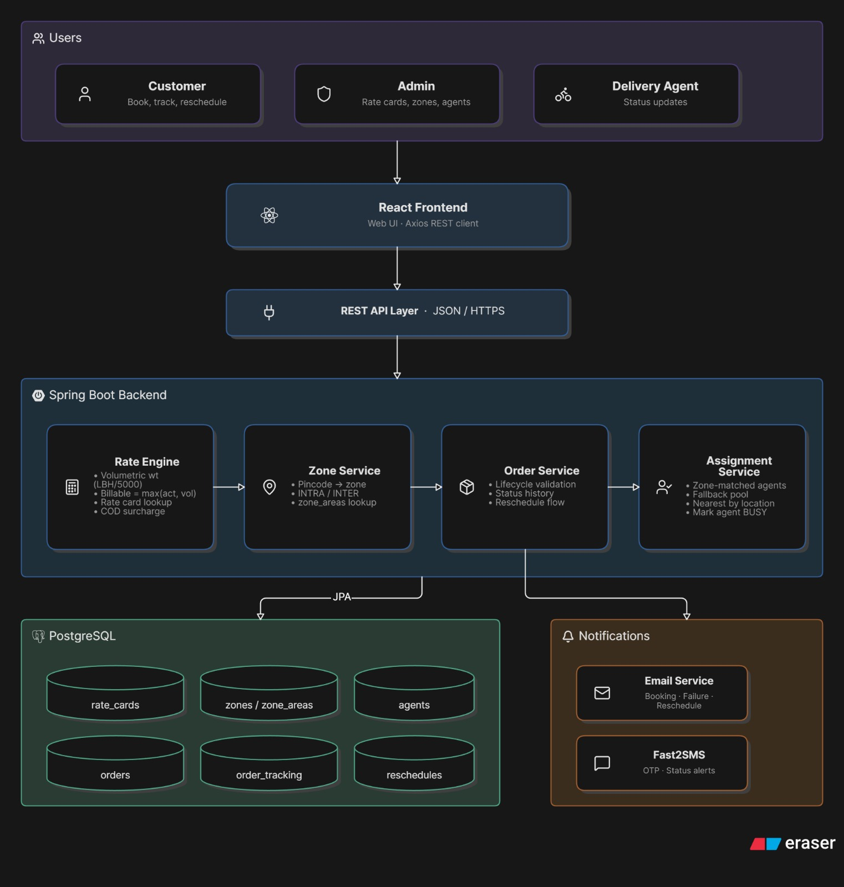

# ParcelGo — System Design

ParcelGo is a last-mile delivery management system designed to handle shipping charge calculation, zone identification, agent assignment, order tracking, and customer notifications.

The application uses a **React frontend**, **Spring Boot backend**, and **PostgreSQL database**. The frontend communicates with the backend through REST APIs, with separate access for customers, delivery agents, and admins.

## 1. System Architecture

The basic flow is:

**Customer / Admin / Delivery Agent → React → REST API → Spring Boot → PostgreSQL**

The backend separates responsibilities such as order management, pricing, zone detection, agent assignment, and notifications. This keeps the business logic easier to maintain and test.



Flyway manages database migrations, Spring Mail handles emails, and Fast2SMS handles SMS notifications.

## 2. Rate Calculation Engine

Pricing is stored in the database instead of being hardcoded, allowing admins to update rates without changing the application code.

The customer provides pickup and drop pincodes, package dimensions, actual weight, order type (**B2B/B2C**), and payment type (**Prepaid/COD**).

First, the system finds both zones using the `zone_areas` table. If a pincode is not configured, the calculation stops with an error.

Volumetric weight is calculated as:

**Volumetric Weight = (L × B × H) / 5000**

The billable weight is:

```text
Billable Weight = max(Actual Weight, Volumetric Weight)
```

The system then determines whether the shipment is **INTRA** or **INTER** based on the pickup and drop zones.

The rate card is selected using:

* B2B or B2C
* INTRA or INTER
* Billable weight range

The base charge and per-kg rate are applied, and a COD surcharge is added when required. The final amount and calculation details are returned before order confirmation so the customer can understand the charge.

## 3. Zone Detection

ParcelGo uses pincodes to determine delivery zones. Multiple pincodes can belong to one zone and are stored in `zone_areas`.

```text
Pickup Pincode → Pickup Zone
Drop Pincode   → Drop Zone

Same Zone      → INTRA
Different Zone → INTER
```

This approach is simple and suitable for the current requirements. Admins can update pincode mappings without changing the code. Missing pincodes return an error instead of using an incorrect default zone.

## 4. Auto-Assignment

ParcelGo supports manual and automatic agent assignment.

For automatic assignment, the system first looks for agents who are `AVAILABLE` and belong to the order's delivery zone. If none are available, it checks other available agents. When location information is available, the nearest suitable agent can be selected.

After assignment:

```text
Order → Assigned to Agent
Agent → AVAILABLE → BUSY
```

The assignment logic is separate from order management so it can later consider factors such as distance, workload, or estimated delivery time.

## 5. Order Status and Tracking

Orders follow a controlled lifecycle:

```text
CONFIRMED → PICKED_UP → IN_TRANSIT → OUT_FOR_DELIVERY → DELIVERED
```

For a failed delivery:

```text
OUT_FOR_DELIVERY → FAILED → RESCHEDULE → CONFIRMED
```

The backend validates every status transition to prevent invalid changes.

The current status is stored in the `orders` table for quick access. Every status change is also recorded in `order_tracking` with the status, actor, notes, and timestamp. This provides both the current status and the complete history of the order.

## 6. Failed Delivery Handling

When an agent marks an order as `FAILED`, the customer is notified and can select a new delivery date.

The reschedule record stores the original date, new date, and optional reason. The previous agent becomes `AVAILABLE`, and the order returns to `CONFIRMED`. The system then attempts to assign another available agent.

If no agent is available, the order remains unassigned and an admin can assign one later. The failed attempt remains in `order_tracking`, preserving the complete delivery history.

## 7. Notifications

Customers receive notifications when important order events occur.

Email notifications use **Spring Mail**. SMS notifications use **Fast2SMS**, configured through the environment variable:

```text
FAST2SMS_API_KEY
```

Notifications are kept separate from the main order logic. If an email or SMS fails, the order status and tracking history are still saved correctly.

## 8. Database Design

PostgreSQL stores the main delivery data, including:

* Users and customers
* Delivery agents
* Orders
* Zones and zone areas
* Rate cards
* COD surcharges
* Assignments
* Order tracking
* Reschedules

The `orders` table stores the current state, while `order_tracking` preserves the complete history. Rate cards and zone mappings are database-driven, allowing configuration changes without modifying application code.

Flyway manages schema changes through version-controlled migrations, making database updates consistent across environments.

## 9. Design Approach

The main design goal was to keep ParcelGo simple while separating responsibilities that may change independently.

Pricing, zone detection, agent assignment, tracking, and notifications are handled as separate concerns. This makes the system easier to maintain and leaves room for future improvements.

Overall, the design focuses on **configurable pricing, reliable order processing, clear tracking, practical agent assignment, and maintainable business logic** without adding unnecessary complexity.
